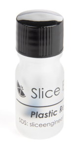

# Overordnet for alle

Der findes mange former for filamenter og de fleste filamenter har nogle særlige ting der gør sig gældende for dem det kan blandt andet være

* Opbevaring
* Temperatur de skal printes ved
* Mekaniske egenskaber
    * Temperatur resistens
    * Styrke / brud / træk
* Særlige krav til opbevaring
* Fare - er det giftigt?
* Bortskaffelse
* Fibre

## Myter om temperatur

Der er mange der er meget besat af om man køre korrekt temperatur, alle temperaturer er som udgangspunkt vejledende, den måde som man måler temperaturen på - på en hjemme 3D printer er med en NTC modstand, og den er faktisk ret upræcis, derfor er det rigtigt vigtigt at du selv konkludere hvad din printer køre bedst med, du bør overveje følgende parametre

- [x] Temperatur i det rum du står i
- [x] Træk fra åbne vinduer?
- [x] Kabinet til printer
- [x] Er dit filament tørt - eller måske fugtigt?

## PLA

PLA (polylactid) er en type bioplastik, der er lavet af majsstivelse eller sukkerrør, og den er kendt for sin miljøvenlige karakter og lette tilgængelighed. PLA er en termoplastisk plastik, som betyder, at den kan opvarmes og formes ved høje temperaturer.

PLA plastik har en række fordele, der gør det populært til en bred vifte af anvendelser. For det første er PLA biologisk nedbrydeligt og kan omdannes til naturlige materialer, hvilket gør det til et miljøvenligt alternativ til traditionelle plastikmaterialer. Det er også stærkt, holdbart og let at arbejde med.

PLA plastik er populært inden for 3D-printing på grund af dets lave smeltepunkt, hvilket gør det nemt at 3D-printe ved hjælp af Fused Deposition Modeling (FDM) teknologi. Det er også populært til fremstilling af engangsartikler, madbeholdere, kosmetikbeholdere og emballage. PLA kan fremstilles i en række farver og finish, herunder gennemsigtig, mat og glans.

Selvom PLA har mange fordele, har det også nogle begrænsninger. Det er f.eks. ikke så modstandsdygtigt over for varme og kemikalier som traditionelle plastikmaterialer, og det kan brydes eller deformeres, hvis det udsættes for høje temperaturer.

### Indstillinger

| :fontawesome-solid-temperature-half: Nozzle temp  [^1] | :fontawesome-solid-temperature-half: Bed temp  [^1] | :material-fan: Blæser % | :material-speedometer: Fart                       | :material-train-car-flatbed: BuildPlate |
| ------------------------------------------------------ | --------------------------------------------------- | ----------------------- | ------------------------------------------------- | --------------------------------------- |
| 200-210 :material-temperature-celsius:                 | 40-60 :material-temperature-celsius:                | 100%                    | Så længe der er køl nok er der ingen problemer | PEI, Glas, næsten alt                   |

### Krav til printer

Der er som sådan ikke nogle krav til printeren - alle moderne printere der er lavet indenfor de sidste mange år kan printe PLA

### Fordele

* Er billigt
* Er nemt at printe med for en begynder
* Kræver ikke kabinet
* Kræver ikke høje temperaturer
* Mange bruger det så er der er meget viden på nettet
* Er "ikke" usundt at indhånde

### Ulemper

* Er ikke modstandsdygtigt overfor UV (Nedbrydes i solen)
* Kan ikke tåle høj temperatur
* Brækker lige over - er ikke særlig sejt
* PLA har en meget lav [glas transitionstemperatur]

## PETG

PETG plastik (også kendt som glycol-modificeret PET eller glycol-modificeret polyester) er en type termoplastisk plastik, der er kendt for sin styrke, klarhed og modstandsdygtighed over for brud.

PETG er en videreudvikling af PET (polyethylenterephthalat), som normalt bruges til at fremstille engangsflasker til drikkevarer. Ved at tilsætte glycol til PET kan man opnå PETG, som har forbedrede egenskaber, der gør det mere velegnet til industrielle applikationer.

PETG plastik har en høj styrke-til-vægt-forhold, hvilket betyder, at det er stærkt og holdbart, men samtidig let og nemt at arbejde med. Det er også modstandsdygtigt over for UV-lys, kemikalier og stød, og det kan modstå gentagne bøjninger uden at sprække eller knække.

På grund af disse egenskaber anvendes PETG plastik ofte til fremstilling af produkter som skilte, displays, emballage, beskyttelsesbriller og medicinske udstyrskomponenter. Det kan også 3D-printes, hvilket gør det populært blandt hobbyister og professionelle, der ønsker at skabe prototyper og færdige produkter i plastik.

### Indstillinger

| :fontawesome-solid-temperature-half: Nozzle temp  [^1] | :fontawesome-solid-temperature-half: Bed temp  [^1] | :material-fan: Blæser % | :material-speedometer: Fart                    | :material-train-car-flatbed: BuildPlate |
| ------------------------------------------------------ | --------------------------------------------------- | ----------------------- | ---------------------------------------------- | --------------------------------------- |
| 230-240 :material-temperature-celsius:                 | 70-80 :material-temperature-celsius:                | 20%                     | Gerne hurtigt da PETG kan ooze ret kraftigt | PEI men med noget på Textured plate  |

### Krav til printer

Der er som sådan ikke nogle krav til printeren - alle moderne printere der er lavet indenfor de sidste mange år kan printe PETG, det anbefales dog man som minimum har en silikone sock på nozzle, da PETG er ret klistreret, alternativ kan man smøre noget [teflon maling](https://www.bondtech.se/product/plastic-repellent-paint/){ target=_blank } på som vist herunder

Det kan også anbefales du bruger et [separator middel] produkt især hvis du køre på glasplader

### Fordele

* Er rigtig sejt, dvs. bøjer før det knækker
* Billigt at få fat i
* Kan tåle højere temperatur før det deformere

### Ulemper

* Kræver det er tørt!
* Printer skal være ret godt justeret ind da du ellers blot vil ende med en stor klump på din nozzle
* PETG har en lidt bedre [glas transitionstemperatur] end [PLA] - man stadig ikke på højde med hverken [ABS] eller [ASA]

### Advarsel :warning:

* Print ALDRIG PETG direkte på en glasplade, du skal have en eller anden seperator på for at være sikker på du kan få det af når det er koldt.

## ABS

ABS (akrylonitril-butadien-styren) plastik er en termoplastisk polymer, der er kendt for sin styrke, stivhed og modstandsdygtighed over for stød og varme. ABS plastik er sammensat af tre forskellige monomerer: akrylonitril, butadien og styren.

ABS plastik har en række egenskaber, der gør det populært til en bred vifte af anvendelser. Det er stærkt og holdbart, og det kan modstå stød og varme, hvilket gør det velegnet til produktion af dele og komponenter til maskiner, biler, elektronik og legetøj. Det er også modstandsdygtigt over for kemikalier og kan male og overfladebehandles nemt.

ABS plastik har også nogle ulemper. Det kan være vanskeligt at 3D-printe, fordi det kræver en højere temperatur og er mere modtageligt for warping og splitting end andre materialer som [PLA]. Det afgiver også en lugt, når det smelter, og dampene kan være skadelige, hvis de indåndes over længere tid. Derfor anbefales det normalt at 3D-printe ABS i et rum med god ventilation.

Alt i alt er ABS plastik en alsidig plasttype med en række egenskaber, der gør det velegnet til en bred vifte af applikationer, herunder 3D-printning, mekaniske dele og elektronik.

### Indstillinger

| :fontawesome-solid-temperature-half: Nozzle temp  [^1] | :fontawesome-solid-temperature-half: Bed temp  [^1] | :material-fan: Blæser % | :material-speedometer: Fart | :material-train-car-flatbed: BuildPlate |
| ------------------------------------------------------ | --------------------------------------------------- | ----------------------- | --------------------------- | --------------------------------------- |
| 240-260 :material-temperature-celsius:                 | 100-110 :material-temperature-celsius:              | 10-20%                  | Så hurtigt din printer kan  | PEI, enten smooth eller textured        |

### Krav til printer

* Enclosure

### Fordele

* Du kan nemt eftebehandle ABS, det er nemt at bore i, du kan slibe på det og male på det uden større udfordringer
* Kan hål meget høj temperatur

### Ulemper

## ASA

Både [ABS] (akrylonitril-butadien-styren) og ASA (akrylonitril-styren-acrylester) er termoplastiske polymerer, der anvendes til fremstilling af stærke, holdbare dele og komponenter. De er begge modstandsdygtige over for stød og vejrforhold og har en lignende sammensætning, men der er nogle vigtige forskelle mellem de to materialer.

En af de største forskelle mellem [ABS] og ASA er, at ASA er mere modstandsdygtig over for vejrpåvirkninger end [ABS]. ASA er mere UV-stabil end ABS, og det bevarer sin farve og overfladebehandling bedre i sollys og ekstreme temperaturer. Derfor er ASA ofte foretrukket til udendørs anvendelser, hvor materialet vil blive udsat for sollys og andre vejrforhold.

En anden forskel mellem [ABS] og ASA er, at ASA normalt er mere kemisk modstandsdygtig end ABS. ASA kan modstå kemikalier som alkohol, benzin og olie bedre end ABS, og det er mindre modtageligt for misfarvning eller deformation, når det udsættes for kemikalier.

En tredje forskel er, at ASA normalt er mere glansfuldt end ABS og giver en glattere overfladefinish. Dette gør ASA til et populært valg til applikationer, hvor udseendet er vigtigt, såsom bildele og elektronik.

I forhold til 3D-printning kan ASA være lidt mere vanskeligt at printe end ABS, da det kræver en højere temperatur og mere avancerede printerindstillinger. Dog er ASA mere modstandsdygtig over for warping og splitting end [ABS] og er derfor et bedre valg til større print.

I alt er både [ABS] og ASA populære materialer til fremstilling af dele og komponenter, men ASA er normalt mere velegnet til udendørs applikationer, hvor det er udsat for sollys og andre vejrforhold, mens ABS er mere alsidigt og kan anvendes i en bred vifte af applikationer.

### Indstillinger

Samme som [ABS]

### Krav til printer

Samme som [ABS], dog gerne endnu højere temperatur på kabinet

### Fordele

Samme som [ABS] dog med følgende yderligere fordele

* Bedre til at modstå UV lys
* Warper mindre end [ABS]

### Ulemper

Samme som [ABS]

## PA (Nylon)

PA (Polyamid), også kendt som nylon, er en type termoplastisk plastik, der er kendt for sin styrke, holdbarhed og modstandsdygtighed over for slid. PA plastik er en polymer, der er sammensat af enheder af amidbindinger.

PA plastik har en række egenskaber, der gør det velegnet til en bred vifte af anvendelser. Det er stærkt og slidstærkt og kan modstå gentagne belastninger uden at bryde eller miste sin form. Det er også modstandsdygtigt over for kemikalier, varme og korrosion, hvilket gør det velegnet til anvendelser i miljøer, hvor der er høje krav til holdbarhed og modstandsdygtighed.

PA plastik er populær i en række forskellige applikationer, herunder bil- og flydele, elektronik, legetøj og sportsudstyr. Det kan også 3D-printes, hvilket gør det populært blandt hobbyister og professionelle, der ønsker at skabe prototyper og færdige produkter i plastik.

I forhold til 3D-printing kan PA være vanskeligere at printe end traditionelle plastikmaterialer på grund af dets høje smeltepunkt og tendens til at absorbere fugt fra luften, hvilket kan påvirke printkvaliteten og holdbarheden. Derfor kræver det ofte en speciel tørring og forberedelse af filamentet, inden det kan 3D-printes.

I alt er PA plastik en stærk og alsidig termoplastisk plastik, der er velegnet til mange forskellige applikationer, der kræver holdbarhed, modstandsdygtighed over for slid og kemikalier og høj styrke.

### Indstillinger

| :fontawesome-solid-temperature-half: Nozzle temp  [^1] | :fontawesome-solid-temperature-half: Bed temp  [^1] | :material-fan: Blæser % | :material-speedometer: Fart | :material-train-car-flatbed: BuildPlate |
| ------------------------------------------------------ | --------------------------------------------------- | ----------------------- | --------------------------- | --------------------------------------- |
| XX :material-temperature-celsius:                      | XX :material-temperature-celsius:                   | XX%                     | XX                          | XX                                      |

### Krav til printer

### Fordele

### Ulemper

## TPU (Gummi)

TPU (Thermoplastic Polyurethane) plastik er en type termoplastisk elastomer, der er kendt for sin fleksibilitet, modstandsdygtighed over for stød og slid og alsidighed. TPU plastik er sammensat af polyurethan, som er en polymer, der består af enheder af urethanbindinger.

TPU plastik har en række egenskaber, der gør det velegnet til en bred vifte af applikationer. Det er meget fleksibelt og kan bøjes, strækkes og komprimeres gentagne gange uden at sprække eller miste sin form. Det er også modstandsdygtigt over for stød og slid, hvilket gør det velegnet til applikationer, hvor materialet vil blive udsat for belastning og gnidning.

TPU plastik kan fremstilles i en række forskellige hårdheder og farver, hvilket gør det alsidigt og brugbart i mange forskellige applikationer. Det bruges ofte til produktion af sko og støvler, sportsudstyr, elektronik tilfælde og dæksler, medicinske udstyrskomponenter, og det er også populært i 3D-printing på grund af dets fleksibilitet og modstandsdygtighed.

I forhold til 3D-printing kan TPU være vanskeligere at printe end traditionelle plastikmaterialer på grund af dets fleksibilitet. Det kan kræve specielle indstillinger på en 3D-printer, herunder lavere hastighed, højere temperatur og brug af en printplatform med bedre greb.

I alt er TPU plastik en alsidig og holdbar elastomer, der er velegnet til mange forskellige applikationer, der kræver fleksibilitet, slidstyrke og modstandsdygtighed over for stød.

### Indstillinger

| :fontawesome-solid-temperature-half: Nozzle temp  [^1] | :fontawesome-solid-temperature-half: Bed temp  [^1] | :material-fan: Blæser % | :material-speedometer: Fart | :material-train-car-flatbed: BuildPlate |
| ------------------------------------------------------ | --------------------------------------------------- | ----------------------- | --------------------------- | --------------------------------------- |
| XX :material-temperature-celsius:                      | XX :material-temperature-celsius:                   | XX%                     | XX                          | XX                                      |

### Krav til printer

### Fordele

### Ulemper

## Fibre

<!-- 

## Skabelon

### Indstillinger

| :fontawesome-solid-temperature-half: Nozzle temp  [^1] | :fontawesome-solid-temperature-half: Bed temp  [^1] | :material-fan: Blæser % | :material-speedometer: Fart | :material-train-car-flatbed: BuildPlate |
| ------------------------------------------------------ | --------------------------------------------------- | ----------------------- | --------------------------- | --------------------------------------- |
| XX :material-temperature-celsius:                      | XX :material-temperature-celsius:                   | XX%                     | XX                          | XX                                      |

### Krav til printer

### Fordele

### Ulemper 

-->

[^1]: Alle temperaturer er vejledende, du skal altid selv kalibrere for din printer

[separator middel]: tipstricks.md#separator
[ABS]: #abs
[PLA]: #pla
[PETG]: #petg
[ASA]: #asa
[glas transitionstemperatur]: ordbog.md#glas-transitionstemperaturen