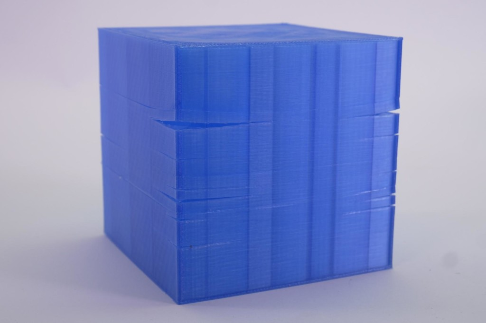

## Glas transitionstemperaturen

Plastik glas transitionstemperaturen (Tg) er den temperatur, hvor en termoplastisk polymer går fra at være hård og stiv til at blive blød og formbar. Når temperaturen nærmer sig Tg, begynder polymerens molekyler at bevæge sig mere frit og uordnet, hvilket reducerer materialets stivhed og gør det mere fleksibelt.

Tg er en vigtig parameter i plastikkens egenskaber, da det kan påvirke dens anvendelse og ydeevne. Hvis en plasttype udsættes for temperaturer over dens Tg, kan den blive for blød og miste sin form, mens en plasttype, der udsættes for temperaturer under dens Tg, kan blive for hård og skør.

For eksempel, hvis du har en plastikflaske, der er fyldt med varm væske og derefter sætter den i køleskabet, kan plastikken blive for hård og skør, hvis temperaturen går under dens Tg. På den anden side kan en plastikpose blive for blød og miste sin form, hvis den udsættes for høje temperaturer over dens Tg.

Tg kan varierer fra materiale til materiale, og det kan påvirkes af forskellige faktorer, såsom polymerens sammensætning, dens molekylære struktur og dens kædearrangement. Derfor er det vigtigt at kende Tg for den specifikke plasttype, du arbejder med, for at sikre, at det anvendes korrekt i forhold til temperatur og andre miljøfaktorer.

## Thermoplastik

Thermoplastik er en type plastik, der er kendetegnet ved sin evne til at blive blødgjort og formet ved opvarmning og stivne igen ved afkøling. Dette sker, fordi termoplastiske materialer består af lange, kædelignende polymermolekyler, der er bundet sammen af svage intermolekylære kræfter, som kan brydes ved opvarmning og genoprettes ved afkøling.

Termoplastik kan genanvendes og genformes flere gange, hvilket gør det meget alsidigt og økonomisk i forhold til andre plastiktyper, der er mere svære at bearbejde. Termoplastik kan også fremstilles i en række forskellige farver og hårdheder, og det kan tilsættes forskellige tilsætningsstoffer for at forbedre dets egenskaber, såsom styrke, stivhed, modstandsdygtighed over for UV-lys og kemikalier og mere.

Termoplastik anvendes i en bred vifte af applikationer, herunder emballage, medicinsk udstyr, elektronik, bil- og flyindustri, byggeri, møbelproduktion og meget mere. Nogle af de mest almindelige termoplastiske materialer omfatter [ABS], [PLA], [PET], PVC, [nylon] og polyethylen.

En af fordelene ved termoplastik er, at det er relativt let at genanvende og genbruge, hvilket gør det mere miljøvenligt end andre plastiktyper, der kan være sværere at bryde ned og recirkulere. Det er også ofte mere økonomisk og har en bredere vifte af anvendelser på grund af dets alsidighed og fleksibilitet.

I alt er termoplastik en alsidig og vigtig type plastik, der er velegnet til mange forskellige anvendelser, og som har en række fordele i forhold til andre typer plastik.

## FDM

FDM (Fused Deposition Modeling) er en af de mest almindelige 3D-printteknologier og er baseret på en lag-for-lag-opbygning af et objekt fra en spole af plastikfilament. FDM printere bruger en termoplastisk filament, der føres gennem en opvarmet dyse, der smelter filamentet og deponerer det lag-for-lag for at opbygge det ønskede objekt.

FDM-printprocessen starter med at designe et objekt ved hjælp af 3D-modelleringssoftware. Derefter forberedes en printerfil med instruktioner til printeren om, hvordan objektet skal opbygges lag for lag. Denne printerfil overføres derefter til 3D-printeren, som læser instruktionerne og begynder at opbygge det ønskede objekt.

Under FDM-printprocessen føres filamentet gennem en opvarmet dyse, som smelter filamentet og deponerer det på en printerplatform i det ønskede mønster. Når et lag er færdigprintet, hæves printerplatformen en lille smule, og en ny lag filament tilføjes, indtil hele objektet er fuldført.

FDM-printere kan bruge en række forskellige termoplastiske filamenter, herunder [ABS], [PLA], [PA] og [TPU]. Filamenterne varierer i egenskaber, såsom styrke, holdbarhed, fleksibilitet og farve. FDM-printere kan også variere i størrelse og opløsning, hvilket påvirker printets detaljeringsgrad og kvalitet.

FDM-printere er relativt billige og nemme at bruge, og de er velegnede til at producere prototyper og mindre produktionsserier. Dog kan de have visse udfordringer såsom krav til støttestrukturer, ujævne overflader og printlinjer, som kan kræve efterbehandling for at opnå et glat og færdigt produkt.

Alt i alt er FDM en alsidig og populær 3D-printteknologi, der er velegnet til mange forskellige applikationer og anvendelser.

## Warping

{ width=500px }

Warping er en almindelig problematik i 3D-printing, hvor det færdige print krøller op og løsner sig fra printpladen eller printerplatformen. Warping opstår typisk på grund af temperaturforskelle mellem den varme og afkølede del af 3D-objektet.

Når plastikfilamentet smelter og deponeres på printpladen eller printerplatformen, varmes det op og udvides. Når materialet afkøles igen, trækker det sig sammen og kan forårsage en kraft, der løsner det fra printpladen. Dette kan forårsage en skæv eller skæv overflade på det færdige print eller helt ødelægge det.

Der er flere måder at undgå warping på, når man 3D-printer. En måde er at bruge en varmeplade, der kan varmes op for at reducere temperaturforskellen mellem det varme og afkølede materiale. En anden måde er at justere printerindstillingerne, så der printes med en højere temperatur, hvilket kan reducere risikoen for warping. Det kan også hjælpe at bruge en filamentopbevaringsboks for at holde filamentet tørt og fri for fugt, da fugt i filamentet kan forværre warping.

Andre metoder til at reducere risikoen for warping inkluderer at justere printopsætningen for at optimere printparametrene, såsom lagtykkelse, hastighed og afkølingstid. Det kan også hjælpe at bruge en speciel printerklæbemiddel på printpladen eller printerplatformen for at holde materialet på plads og reducere risikoen for warping.

I alt er warping en almindelig udfordring i 3D-printing, men der er flere måder at reducere risikoen for det. Ved at justere printerindstillingerne og bruge de rigtige teknikker kan man minimere eller helt undgå warping og opnå en vellykket 3D-printingoplevelse.

## Delaminering

{ width=500px }

Delaminering er en almindelig udfordring i 3D-printing, hvor de enkelte lag af plastik i et print adskilles fra hinanden. Delaminering kan ske af flere årsager, herunder unøjagtige printerindstillinger, for hurtig afkøling af materialet, forkert printopsætning eller for højt vandindhold i filamentet.

Delaminering kan resultere i et print, der har en skrøbelig eller porøs struktur, eller som helt falder fra hinanden. Det kan også påvirke styrke og stabilitet af printet.

Der er flere måder at undgå delaminering på, når man 3D-printer. En måde er at justere printerindstillingerne, så der printes med de rigtige hastigheder og temperaturen er korrekt. Det kan også hjælpe at øge opvarmningstiden og tilføje en ekstra varmekilde, hvis det er muligt. Det er også vigtigt at vælge det rigtige filamentmateriale og undgå at bruge materiale, der er blevet udsat for fugt eller ikke er af god kvalitet.

For at undgå delaminering kan det også hjælpe at tage hensyn til printopsætningen, og sikre at der er en tilstrækkelig hæftning mellem det færdige print og printerplatformen. Det kan også hjælpe at optimere afkølingstiden, så materialet afkøles langsomt og jævnt, hvilket reducerer risikoen for delaminering.

I alt er delaminering en udfordring i 3D-printing, men der er flere måder at undgå det på. Ved at justere printerindstillingerne og vælge det rigtige filamentmateriale, samt sikre ordentlig hæftning og optimal afkølingstid, kan man minimere eller helt undgå delaminering og opnå en vellykket 3D-printingoplevelse.

## Vådt filament

Vådt filament er en tilstand, hvor 3D-printermaterialet, som normalt er tørt, er blevet udsat for fugt og har optaget en vis mængde fugt. Dette kan føre til problemer under 3D-printprocessen, da det fugtige filament kan forårsage dårlig kvalitet, uregelmæssige strukturer og dårlig adhæsion til printpladen eller printerplatformen.

Symptomer på vådt filament kan omfatte:

* Bobler
    * Når vådt filament smelter i hotenden, kan det danne små bobler i det smeltede materiale, som kan påvirke printkvaliteten og forårsage ujævnheder i det færdige print.
* Sprødhed
    * Vådt filament kan blive mere sprødt end normalt, hvilket kan resultere i en højere risiko for at filamentet brydes eller revner under printprocessen.
* Svag adhæsion
    * Vådt filament kan have problemer med at binde sig til printpladen eller printerplatformen, hvilket kan føre til dårlig kvalitet og løse dele på det færdige print.
* Ujævne strukturer
    * Vådt filament kan resultere i ujævne strukturer og uregelmæssigheder i det færdige print, hvilket kan påvirke printkvaliteten og æstetikken.

{width=400px}

* Damp og høje lyde
    * Når vådt filament smelter, kan det producere damp og høje lyde, hvilket kan indikere, at filamentet er blevet påvirket af fugt og er vådt.

Hvis du oplever nogen af disse symptomer, kan det være en god idé at kontrollere filamentet for fugt og eventuelt tørre det i en tørreovn eller lufttæt beholder med tørmiddel for at genoprette den optimale printkvalitet.

Et eksempel på en Filament Dryer kunne være nedenstående

{width=500px}

Men det er også muligt at bruge en simpel dehydrator fra køkkenet

{width=500px}

[ABS]: filamenter.md#abs
[PLA]: filamenter.md#pla
[PET]: filamenter.md#peth
[TPU]: filamenter.md#tpu
[PA]: filamenter.md#pa-nylon
[nylon]: filamenter.md#pa-nylon