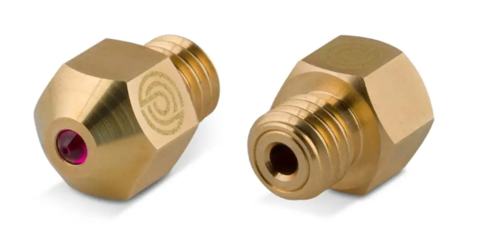
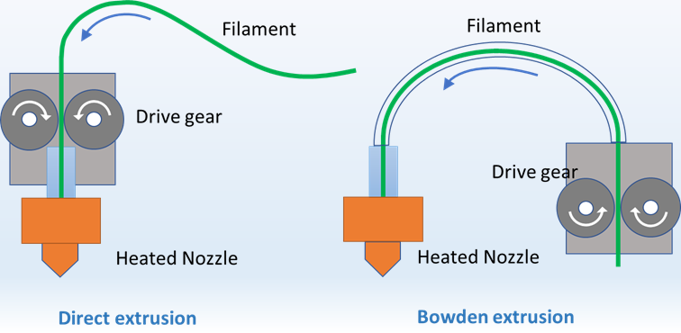
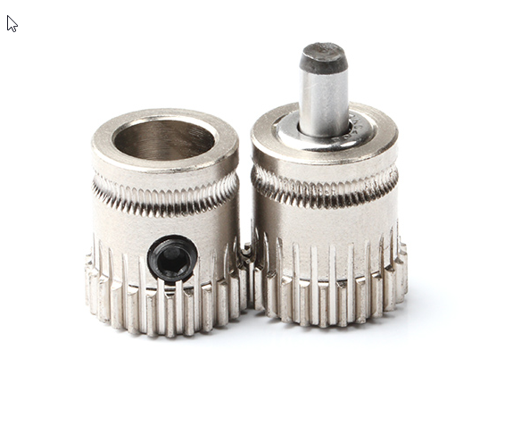
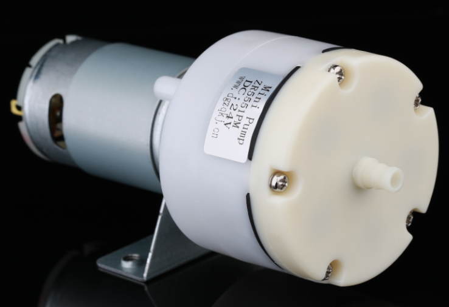

# Printer

En 3D printer er ikke bare en 3D printer men meget har de dog meget tilfælles, nogle ting er bare nemmere på nogle typer printere, og nogle filamenter kræver specielle features af din printer f.eks. temperatur på nozzle, build plate og måske et opvarmet kammer.

En printer står ikke alene, for ultimativt er printeren jo alene nogle motor, et varmelegme og et par sensorer. Resten af det der sker er jo ren software og timing.

Noget software ligger i printeren - noget er den slicer der laver GCode din printer kan bruge

## Enclosure / Kabinet

En enclosed printer, eller en 3D-printer med en indkapslet byggekammer, kan have flere fordele i forhold til en åben printer. Her er nogle af de vigtigste fordele:

1. __Bedre temperaturkontrol__: En enclosed printer holder temperaturen mere stabil og ensartet, da varmen ikke kan undslippe så let. Dette kan forbedre printkvaliteten og reducere risikoen for warping og delaminering.
2. __Støjdæmpning__: En enclosed printer kan reducere støjen fra printerens bevægelser og ventilatorerne, hvilket kan være en fordel i støjfølsomme omgivelser.
3. __Støvbeskyttelse__: En enclosed printer kan beskytte printet mod støv og snavs, som kan påvirke printkvaliteten.
4. __Øget sikkerhed__: En enclosed printer kan forhindre brugerne i at komme i kontakt med varme dele eller bevægelige dele, hvilket øger sikkerheden for brugerne.
5. __Bedre adhæsion__: En enclosed printer kan skabe et mere konstant miljø, hvilket kan forbedre adhæsionen mellem printet og printerpladen eller printerplatformen.
6. __Mulighed for at printe med mere krævende materialer__: En enclosed printer kan give mulighed for at printe med mere krævende materialer, der kræver højere temperaturer og mere præcis temperaturkontrol.

Det er dog vigtigt at bemærke, at en enclosed printer normalt er dyrere end en åben printer, og at det kan være sværere at foretage justeringer eller ændringer på en enclosed printer på grund af den lukkede konstruktion. Derudover kan en enclosed printer kræve mere tid og arbejde for at vedligeholde og rengøre, og der er også risiko for, at en enclosed printer kan blive overophedet, hvis den ikke er korrekt ventileret.

## Nozzle (Dyse)

Generelt set er den valgte type af dyse afhængig af det materiale, der skal printes med, og hvilke krav der er til præcision og detaljering i det færdige print. Det er også vigtigt at vælge en dyse, der passer til ens 3D-printer, da forskellige modeller kan kræve forskellige typer af dyser.

Der findes flere forskellige typer af dyser, der kan bruges i 3D-printere. Her er en kort beskrivelse af nogle af de mest almindelige typer:

### Messingdyser
Messingdyser er den mest almindelige type af dyser og er velegnede til at printe med de fleste termoplastiske materialer som ABS, PLA og PETG. De er slidstærke, varmebestandige og har en jævn overflade, som sikrer præcision og detaljering i det færdige print.

### Ståldyser
Ståldyser er mere holdbare end messingdyser og kan bruges til at printe med mere abrasive materialer, såsom fiberværk eller metalpulver. De kan modstå høje temperaturer og er meget slidstærke, men kan kræve højere printtemperaturer og større printerhastigheder for at opnå en glat og jævn overflade.

### Kobberdyser
Kobberdyser er også et holdbart og slidstærkt valg, der er velegnede til at printe med abrasive materialer og høje temperaturer. Kobberdyser har en jævn overflade, der sikrer præcision og detaljering i det færdige print.

### Olionitrid-dyser
Olionitrid-dyser er lavet af en keramisk belægning, der gør dem mere holdbare end messingdyser og velegnede til at printe med abrasive materialer og høje temperaturer. De har en meget jævn overflade, som sikrer høj præcision og detaljering i det færdige print.

### Messingdyser med ruby indsats
Messingdyser med ruby indsats er en særlig type af messingdyser med en indsats af hårdt, synthetisk ruby-materiale. De er ekstra slidstærke og holdbare og er velegnede til at printe med meget abrasive materialer med f.eks. kulfiber i.

{width=500px}

## Hotends

Generelt set er den valgte type af hotend afhængig af det materiale, der skal printes med, og hvilke krav der er til præcision og detaljering i det færdige print. Det er også vigtigt at vælge en hotend, der passer til ens 3D-printer, da forskellige modeller kan kræve forskellige typer af hotends.

Hotends er en vigtig del af 3D-printerens printproces, da det er her, at plastikfilamentet smeltes og deponeres på printpladen eller printerplatformen. Der findes flere forskellige typer af hotends, der kan bruges i 3D-printere. Her er nogle af de mest almindelige:

### All-metal hotend
All-metal hotends er lavet af varmebestandige metaller, der kan modstå høje temperaturer. De er velegnede til at printe med materialer, der kræver høje temperaturer som ABS og nylon, og kan give en mere jævn varmefordeling, hvilket resulterer i mere præcise og detaljerede prints.

### PTFE-lined hotend
PTFE-lined hotends er belagt med en inderste lag af PTFE (polytetrafluorethylen), et ikke-stick materiale, der gør det lettere at føre plastikfilamentet gennem dysen. De er velegnede til at printe med materialer, der kræver lavere temperaturer som PLA og PETG, men PTFE kan blive beskadiget af høje temperaturer over tid.

Ses ofte på Ender type printere og anbefales ikke til andet end lav temperatur filamenter

### Keramiske hotends
Keramiske hotends er lavet af keramisk materiale, der kan modstå høje temperaturer og giver en jævn varmefordeling. De er velegnede til at printe med materialer, der kræver høje temperaturer, som ABS og nylon, og kan give en mere præcis og detaljeret printkvalitet.

Er sjældent set på hjemme 3D printere

### Dysemoduler
Dysemoduler er modulære hotends, der giver mulighed for at udskifte forskellige dele af hotenden afhængigt af de materialer, der printes med. Dysemoduler kan omfatte forskellige typer af dyser, varmeblokke og køleblokke og kan give større fleksibilitet og muligheder for at tilpasse printindstillingerne til forskellige materialer.

Er sjældent set på Hjemme 3D printere

## Extruders

Generelt set er den valgte type af ekstruder afhængig af det materiale, der skal printes med, og hvilke krav der er til præcision og detaljering i det færdige print. Det er også vigtigt at vælge en ekstruder, der passer til ens 3D-printer, da forskellige modeller kan kræve forskellige typer af ekstrudere.

Extruder er en vigtig del af 3D-printerens printproces, da det er her, at plastikfilamentet føres ind i hotenden, hvor det smeltes og deponeres på printpladen eller printerplatformen. Der findes flere forskellige typer af extrudere, der kan bruges i 3D-printere. Her er nogle af de mest almindelige:

### Bowden extruder
Bowden extruder er en type af ekstruder, hvor en motor på printeren trækker plastikfilamentet gennem en lang, fleksibel slange, der fører til hotenden. Bowden extruder er mere velegnede til højhastighedsprint, da den mindre vægt på selve ekstruderen giver hurtigere bevægelseskontrol over printhovedet.

### Direct drive extruder
Direct drive extruder er en type af ekstruder, hvor en motor på printhovedet trækker plastikfilamentet gennem hotenden. Direct drive extrudere er mere velegnede til at printe med fleksible materialer, da de giver en mere præcis kontrol over filamentet.

### Bowden vs DirectDrive

### Geared extruder
Geared extruder bruger tandhjul til at trække filamentet gennem hotenden og kan opnå en højere trækkraft end andre typer af ekstrudere. Geared extrudere er mere velegnede til at printe med materialer, der kræver højere trækkraft, som for eksempel fiberforstærket materiale.

## Parts Cooling

Generelt set er den valgte type af parts cooling-løsning afhængig af den valgte 3D-printermodel, materialet, der printes med, og de ønskede krav til præcision og detaljering i det færdige print.

Parts cooling er en vigtig del af 3D-printingprocessen, da det sikrer, at plastikfilamentet afkøles hurtigt og jævnt efter deponering på printpladen eller printerplatformen. Dette forhindrer warping, delaminering og andre uønskede effekter, som kan påvirke kvaliteten af det færdige print. Der findes flere forskellige typer af parts cooling-løsninger, som kan bruges i 3D-printere. Her er nogle af de mest almindelige:

### Blæser
Den enkleste form for parts cooling er en blæser, som kan monteres på 3D-printerens hotend og blæse kølig luft på det færdige print. En blæser kan hjælpe med at reducere warping og forbedre præcisionen i detaljeringen på det færdige print.

### Axial fan
Axial fans er mere kraftfulde end almindelige blæsere og kan generere en mere koncentreret strøm af kølig luft. De kan monteres på printhovedet eller printerplatformen og kan justeres for at sikre en jævn køling af det færdige print.

### Radial fan
Radial fans ligner axial fans, men genererer en mere turbulent strøm af luft, der kan afkøle det færdige print hurtigere. De kan monteres på printhovedet eller printerplatformen og justeres for at sikre den rigtige luftstrøm og køling.

### Berd air cooling
Berd Air Cooling er en ekstern luftstrømsenhed, der kan monteres på en 3D-printer for at give ekstra køling til det færdige print. Den fungerer ved at bruge en ventilator til at blæse en strøm af kølig luft på det færdige print, mens det stadig er på printpladen eller printerplatformen. Denne ekstra køling kan hjælpe med at reducere warping og delaminering, især ved print med højere hastigheder og højere temperaturer.

### 

