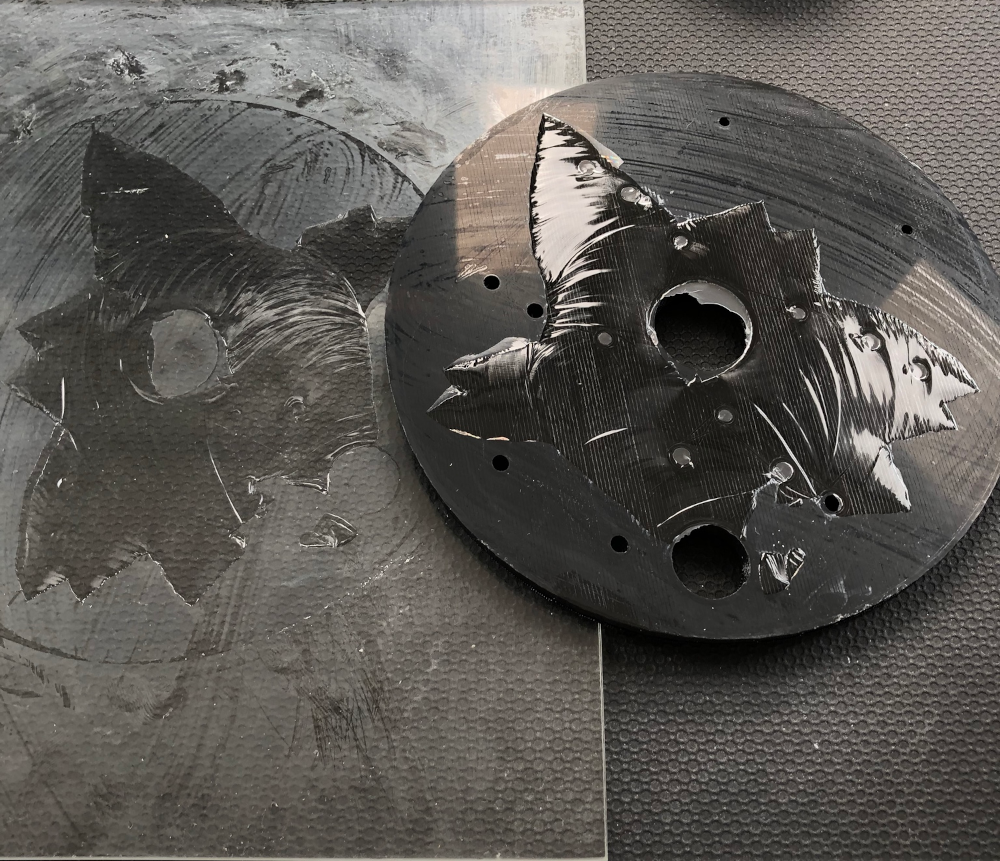

## Bindemiddel

Nogle filamenter kan have svært ved at sidde fast, derfor kan det anbefales at man bruger et bindingsmiddel der er flere eksempler på dette herunder

* Hårlak
* Limstift
* Sukkervand
* [Dimafix](https://3do.dk/tilbehor/272-dimafix-spray.html){ target=_bland } (Lavet til det)
* [Magigoo](https://3deksperten.dk/products/magigoo-original-50ml?variant=43306510450908&gclid=EAIaIQobChMIxeTp68yr_QIVA4xoCR3teggZEAQYASABEgKGOfD_BwE){ target=_bland } (Lavet til det)

:warning: Man bør aldrig bruge f.eks. hårlak eller limstift, da der findes rigtig mange typer af dem og reelt ingen af dem er godkendt til højere temperaturer. Ved at vælge nogle godkendte produkter ved du at du ikke udsætter dig selv for noget unødvendigt.

## Separator

Et bindemiddel har også den modsatte effet, det kan virke som et lag imellem din plade og emnet som gør det nemmer at få enmnet af herunder er et eksempel på PETG printet på glas - hvis der havde været noget imellem havde det være rigtig nemt at få emnet af men det var der ikke så HUSK er du glad for din printer så lad være med at printe PETG på en helt ren plade!

{ width=600px }

Eksempler på separator produkter

* Hårlak
* Limstift
* Sukkervand
* [Dimafix](https://3do.dk/tilbehor/272-dimafix-spray.html){ target=_bland } (Lavet til det)
* [Magigoo](https://3deksperten.dk/products/magigoo-original-50ml?variant=43306510450908&gclid=EAIaIQobChMIxeTp68yr_QIVA4xoCR3teggZEAQYASABEgKGOfD_BwE){ target=_bland } (Lavet til det)
